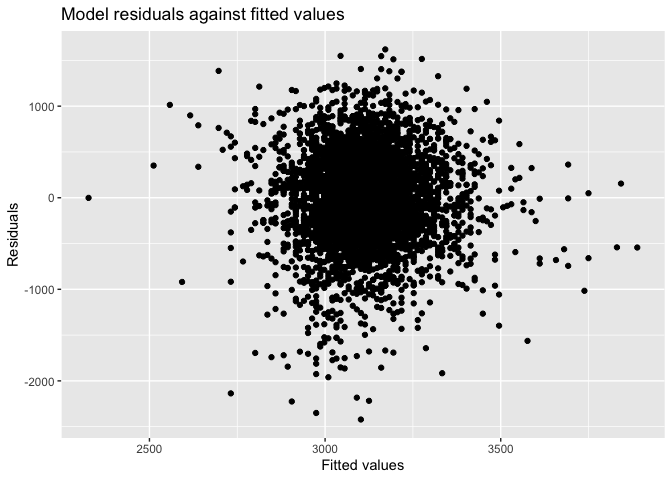

p8105\_hw6\_ra2965
================

``` r
library(modelr)
library(tidyverse)
```

Problem1
========

### Load the crude data and do data cleaning:

convert some variables to factor vectors:

``` r
bwt = read_csv('./data/birthweight.csv')

bwt = bwt %>% 
  mutate(
    babysex = fct_infreq(as.factor(babysex)),
    frace = fct_infreq(as.factor(frace)),
    malform = fct_infreq(as.factor(malform)),
    mrace = fct_infreq(as.factor(mrace))
  )

#checking for missing data?
#bwt %>% 
#filter(is.na(wtgain))
```

There is no missing values.

### Propose a regression model for birthweight

I hypothesized that the baby birthweight can be associated with momage: mother’s age at delivery (years):

``` r
fit = lm(bwt ~ momage, data = bwt)
fit %>% 
  broom::glance() %>% 
    knitr::kable(digits = 3)
```

|  r.squared|  adj.r.squared|   sigma|  statistic|  p.value|   df|     logLik|      AIC|       BIC|    deviance|  df.residual|
|----------:|--------------:|-------:|----------:|--------:|----:|----------:|--------:|---------:|-----------:|------------:|
|      0.018|          0.018|  507.47|     81.508|        0|    2|  -33208.25|  66422.5|  66441.62|  1117661805|         4340|

``` r
fit %>% 
  broom::tidy() 
```

    ## # A tibble: 2 x 5
    ##   term        estimate std.error statistic  p.value
    ##   <chr>          <dbl>     <dbl>     <dbl>    <dbl>
    ## 1 (Intercept)   2750.      41.0      67.0  0.      
    ## 2 momage          17.9      1.99      9.03 2.57e-19

``` r
bwt %>% 
  modelr::add_residuals(fit) %>% 
  modelr::add_predictions(fit) %>% 
  select(momage, bwt, pred, resid) %>% 
  ggplot(aes(x = pred, y = resid)) + 
  geom_point()
```


