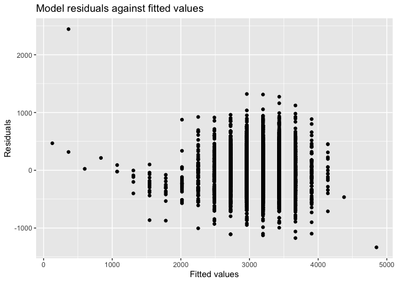

p8105\_hw6\_ra2965
================

``` r
library(modelr)
library(tidyverse)
```

Problem1
========

### Load the crude data and do data cleaning:

convert some variables to factor vectors:

``` r
bwt = read_csv('./data/birthweight.csv')

bwt = bwt %>% 
  mutate(
    babysex = fct_infreq(as.factor(babysex)),
    frace = fct_infreq(as.factor(frace)),
    malform = fct_infreq(as.factor(malform)),
    mrace = fct_infreq(as.factor(mrace))
  )

#checking for missing data?
#bwt %>% 
#filter(is.na(wtgain))
```

There is no missing values.

### Propose a regression model for birthweight

The babies with larger head circumference may have higher birthweight. I hypothesized that the baby birthweight can be associated with bhead: baby’s head circumference at birth (centimeters):

``` r
fit = lm(bwt ~ bhead, data = bwt)
```

``` r
fit %>% 
  broom::tidy() %>% 
  as.tibble()
```

    ## # A tibble: 2 x 5
    ##   term        estimate std.error statistic p.value
    ##   <chr>          <dbl>     <dbl>     <dbl>   <dbl>
    ## 1 (Intercept)   -4831.    107.       -45.0       0
    ## 2 bhead           236.      3.19      74.0       0

I tried to make a linear regression model with a predictor of momage, which is baby’s head circumference at birth (cm), and a outcome of baby birthweight(gram). The p value of the beta of momage is &lt;0.05, which means that the baby birthweight(gram) is significantly associated with baby’s head circumference at birth (cm) at 5% level of significance.

``` r
fit %>% 
  broom::glance() %>% 
  as.tibble()
```

    ## # A tibble: 1 x 11
    ##   r.squared adj.r.squared sigma statistic p.value    df  logLik    AIC
    ##       <dbl>         <dbl> <dbl>     <dbl>   <dbl> <int>   <dbl>  <dbl>
    ## 1     0.558         0.558  340.     5483.       0     2 -31475. 62957.
    ## # … with 3 more variables: BIC <dbl>, deviance <dbl>, df.residual <int>

``` r
bwt %>% 
  modelr::add_residuals(fit) %>% 
  modelr::add_predictions(fit) %>% 
  select(momage, bwt, pred, resid) %>% 
  ggplot(aes(x = pred, y = resid)) + 
  geom_point() +
  labs(
    title = 'Model residuals against fitted values',
    x = 'Fitted values',
    y = 'Residuals'
  )
```



### Compare my model to two others:

One using length at birth and gestational age as predictors (main effects only):

``` r
fit2 = lm(bwt ~ gaweeks + blength, data = bwt)
```

``` r
fit3 = lm(bwt ~ bhead * blength + bhead * babysex + blength * babysex, data = bwt)
```
