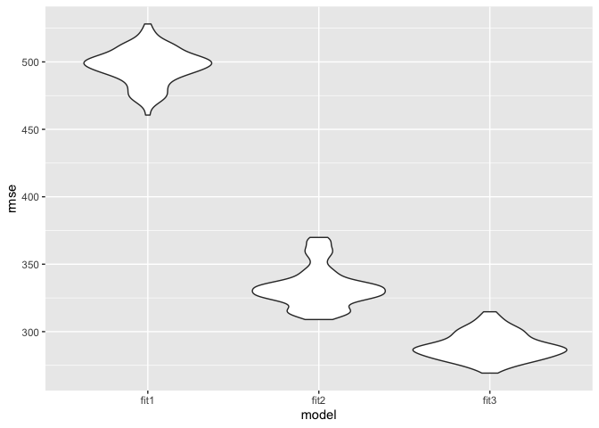

p8105\_hw6\_ra2965
================

``` r
library(modelr)
library(tidyverse)
library(mgcv)
```

Problem1
========

### Load the crude data and do data cleaning:

convert some variables to factor vectors:

``` r
bwt = read_csv('./data/birthweight.csv')

bwt = bwt %>% 
  mutate(
    babysex = fct_infreq(as.factor(babysex)),
    frace = fct_infreq(as.factor(frace)),
    malform = fct_infreq(as.factor(malform)),
    mrace = fct_infreq(as.factor(mrace))
  )
```

There is no missing values.

### Propose a regression model for birthweight

The babies with larger head circumference may have higher birthweight. I hypothesized that the baby birthweight can be associated with bhead: baby’s head circumference at birth (centimeters):

``` r
bwt %>% 
  ggplot(aes(x = wtgain, y = bwt)) +
  geom_point()
```

 It seems there is a positive association between x and y.

Fit a linear regression model:

``` r
fit = lm(bwt ~ wtgain, data = bwt)

bwt %>% 
  add_predictions(fit) %>% 
  ggplot(aes(x = wtgain, y = bwt)) + 
  geom_point() +
  geom_line(aes(y = pred), color = "red")
```


``` r
fit %>% 
  broom::tidy() %>% 
  as.tibble()
```

    ## # A tibble: 2 x 5
    ##   term        estimate std.error statistic  p.value
    ##   <chr>          <dbl>     <dbl>     <dbl>    <dbl>
    ## 1 (Intercept)   2859.     17.0       169.  0.      
    ## 2 wtgain          11.6     0.688      16.8 1.73e-61

``` r
fit %>% 
  broom::glance() %>% 
  as.tibble()
```

    ## # A tibble: 1 x 11
    ##   r.squared adj.r.squared sigma statistic  p.value    df  logLik    AIC
    ##       <dbl>         <dbl> <dbl>     <dbl>    <dbl> <int>   <dbl>  <dbl>
    ## 1    0.0611        0.0609  496.      283. 1.73e-61     2 -33112. 66229.
    ## # … with 3 more variables: BIC <dbl>, deviance <dbl>, df.residual <int>

I tried to make a linear regression model with a predictor of mother’s weight gain during pregnancy (pounds), and a outcome of baby birthweight(gram). The p value of the beta of momage is &lt;0.05, which means that the baby birthweight(gram) is significantly associated with mother’s weight gain during pregnancy at 5% level of significance.

### Show a plot of model residuals against fitted values:

``` r
bwt %>% 
  add_predictions(fit) %>% 
  add_residuals(fit) %>% 
  select(wtgain, bwt, pred, resid) %>% 
  ggplot(aes(x = pred, y = resid)) + 
  geom_point() +
  labs(
    title = 'Model residuals against fitted values',
    x = 'Fitted values',
    y = 'Residuals'
  )
```

 It seems like the error is symmetrically distributed around 0, tending to cluster towards the middle of the plot.

### Compare my model to two others:

One using length at birth and gestational age as predictors (main effects only):

``` r
bwt_df = crossv_mc(bwt, 100) 
bwt_df =
  bwt_df %>% 
  mutate(
    train = map(train, as_tibble),
    test = map(test, as_tibble))

bwt_df = 
  bwt_df %>% 
  mutate(fit1_mod  = map(train, ~lm(bwt ~ wtgain, data = .x)),
         fit2_mod  = map(train, ~lm(bwt ~ gaweeks + blength, data = .x)),
         fit3_mod  = map(train, ~lm(bwt ~ bhead * blength + bhead * babysex + blength * babysex, data = .x))) %>% 
  mutate(rmse_fit1 = map2_dbl(fit1_mod, test, ~rmse(model = .x, data = .y)),
         rmse_fit2 = map2_dbl(fit2_mod, test, ~rmse(model = .x, data = .y)),
         rmse_fit3 = map2_dbl(fit3_mod, test, ~rmse(model = .x, data = .y)))
```

Make a plot showing the distribution of RMSE values for each candidate model:

``` r
bwt_df %>% 
  select(starts_with("rmse")) %>% 
  pivot_longer(
    everything(),
    names_to = "model", 
    values_to = "rmse",
    names_prefix = "rmse_") %>% 
  mutate(model = fct_inorder(model)) %>% 
  ggplot(aes(x = model, y = rmse)) + geom_violin()
```



According to the violine plot, the model using head circumference, length, sex, and all interactions (including the three-way interaction) between these factors as predictors is the best.

Problem 2
=========

### Load the data:

``` r
weather_df = 
  rnoaa::meteo_pull_monitors(
    c("USW00094728"),
    var = c("PRCP", "TMIN", "TMAX"), 
    date_min = "2017-01-01",
    date_max = "2017-12-31") %>%
  mutate(
    name = recode(id, USW00094728 = "CentralPark_NY"),
    tmin = tmin / 10,
    tmax = tmax / 10) %>%
  select(name, id, everything())
```

### Calculate the estimates for r\_squared and log(beta0\*beta1), then tidy data:

``` r
weather_estimates = weather_df %>% 
  modelr::bootstrap(n = 5000) %>% 
  mutate(
    models = map(strap, ~lm(tmax ~ tmin, data = .x)),
    results_beta = map(models, broom::tidy),
    results_r2 = map(models, broom::glance)
    ) %>% 
  select(-models, -strap) %>% 
  unnest() %>% 
  janitor::clean_names() %>% 
  select(id,term, estimate,std_error,statistic,p_value,r_squared)

weather_beta0 = weather_estimates %>% filter(term == "(Intercept)")
weather_beta1 = weather_estimates %>% 
  filter(term == "tmin") %>% 
  select(-r_squared)

weather_results = left_join(weather_beta0,weather_beta1, by = "id") %>% 
  mutate(log = log(estimate.x*estimate.y)) %>% 
  rename(beta0 = estimate.x,
         beta1 = estimate.y,
         se_beta0 = std_error.x,
         se_beta1 = std_error.y) %>% 
  select(beta0,se_beta0, beta1, se_beta1, r_squared, log)
```
